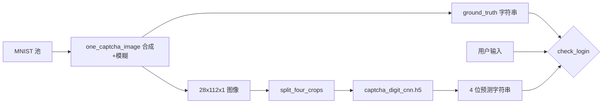

# 代码实现与学习说明

本文档从**数据 → 模型 → 推理 → 界面**串联说明本仓库中与「手写数字识别」和「模糊验证码登录」相关的实现细节，便于阅读源码与撰写报告。

---

## 1. 仓库结构总览

```
项目根目录/
├── app.py                      # Gradio：单字手写识别 Web 界面
├── CNN_Model_Training.ipynb    # 原始 MNIST 单字 CNN 训练流程（Notebook）
├── captcha_synth.py            # 验证码图像合成、MNIST 加载、四宫格切片
├── captcha_backend.py          # 加载 captcha 模型、生成挑战、登录校验
├── train_captcha_cnn.py        # 在合成切片上训练单字 CNN
├── login_captcha_tkinter.py    # Tkinter 登录演示界面
├── data/
│   ├── build_captcha_dataset.py  # 批量生成 npz 数据集
│   └── fetch_mnist_npz.py        # 可选：下载 mnist.npz
├── docs/
│   ├── 项目启动与使用指南.md
│   └── 代码实现与学习说明.md    # 本文档
└── requirements.txt
```

**模型文件**（通常不纳入版本控制或需自行生成）：

- `cnn_model_v2.h5`：`app.py` 使用。  
- `captcha_digit_cnn.h5`：验证码流程使用，由 `train_captcha_cnn.py` 生成。  
- `data/captcha_dataset.npz`：合成训练数据，由 `build_captcha_dataset.py` 生成。

---

## 2. 业务一：`app.py`（Gradio 单字识别）

### 2.1 数据与预处理

- 训练侧见 `CNN_Model_Training.ipynb`：MNIST 归一化、`reshape` 为 `(N, 28, 28, 1)`。  
- **推理侧**（`app.py` 的 `predict`）：  
  - 从 Gradio Sketchpad 得到 RGBA → 取 RGB → `tf.image.rgb_to_grayscale` → 缩放到 **28×28**。  
  - **反色** `255 - image` 再除以 255，使笔画为高亮、背景为暗，与常见 MNIST 笔画极性一致。  
  - `reshape(-1, 28, 28, 1)` 后 `model.predict`。

### 2.2 模型输出

- 最后一层为 **线性输出（logits）**，后处理使用 `tf.nn.softmax` 得到 0–9 概率。  
- 若最大概率 **< 0.5**，返回提示字符串「请重新尝试绘制数字。」，否则返回字典 `{ "0": p0, ... }` 供 `gr.Label` 展示 Top-K。

### 2.3 与 Notebook 的关系

`CNN_Model_Training.ipynb` 中定义了多层 Conv2D + BN + Pooling + Dropout + Dense(10, linear) 的结构；`app.py` 只负责**一致的前处理**与**加载已训练权重**，不参与训练。

---

## 3. 业务二：模糊四连验证码（合成数据 + 单字 CNN）

整体设计思想：**不训练端到端 4 位序列模型**，而是将 **28×112** 的四连图在水平方向均分为 **4 个 28×28**，对每个位置独立做 **10 类分类**；服务端在生成图片时已知真实 4 位字符串（`ground_truth`），与常见验证码会话一致。

### 3.1 数据从哪里来：`captcha_synth.load_mnist_digits`

实现位置：`captcha_synth.py`。

加载顺序（提高可用性）：

1. 环境变量 **`MNIST_NPZ_PATH`** 或项目根目录 **`mnist.npz`**（Keras 标准格式，`x_train`/`y_train` 等）。  
2. **`sklearn.datasets.fetch_openml("mnist_784")`**：得到 784 维向量，reshape 为 `(N, 28, 28)`；对 `target` 做整型兼容（字符串标签时先转 int）。  
3. **`tf.keras.datasets.mnist.load_data()`**：官方默认下载渠道。

这样在同一套代码下兼顾「课程要求从网络获取数据」与「国内/校园网不稳定时的降级」。

### 3.2 单张验证码如何生成：`one_captcha_image`

1. 从池中随机取 **4 个索引**，得到 4 张 **28×28** 灰度图及标签。  
2. 对每位数字做小幅 **旋转**（`scipy.ndimage.rotate`），模拟书写倾斜。  
3. 在宽度维 **拼接** 为 **28×112** 的一行。  
4. 对整行做 **`_blur_and_noise`**：高斯模糊 + 高斯噪声 + 轻微对比度缩放，得到「模糊验证码」观感。  
5. 返回：  
   - `img`：形状 **`(28, 112, 1)`**，float32，约 **[0, 1]**；  
   - `code`：4 位字符串，如 `"7382"`；  
   - 逐位整数标签向量 **`(4,)`**。

### 3.3 切片与推理：`split_four_crops` / `CaptchaLoginBackend.predict_code`

- **`split_four_crops`**：把 `(28,112,1)` 切成 4 块 `(28,28,1)`，堆叠为 **`(4, 28, 28, 1)`**。  
- **`predict_code`**：对该 batch 做一次 `model.predict`，对每行 logits **`argmax`** 得到 4 个数字，再拼成字符串。

注意：训练与推理阶段**单字图像分布**应一致（都来自同一套合成管线），否则精度会下降。

### 3.4 批量数据集：`data/build_captcha_dataset.py`

- 循环调用 `one_captcha_image`（通过内部 `build_many` 逻辑）生成 `n_train` / `n_test` 张四连图。  
- **`expand_to_single_digit_dataset`**：对每张四连图切 4 刀，得到 **4 倍样本量** 的单字数据集 `(4N, 28, 28, 1)` 与标签 `(4N,)`。  
- 写入 **`data/captcha_dataset.npz`**，包含：  
  - `train_images` / `test_images`：四连图；  
  - `train_crops_x` / `train_crops_y`：训练 CNN 用的切片与 0–9 标签；  
  - 以及 `*_codes`、`*_digit_labels` 等便于统计与调试。

命令行参数：`--n-train`、`--n-test`、`--seed`（见脚本内 `argparse`）。

### 3.5 训练脚本：`train_captcha_cnn.py`

- 读取 `data/captcha_dataset.npz` 中的 **`train_crops_x` / `train_crops_y`** 与测试切片。  
- **模型结构**（`build_model`）：  
  - Input `(28,28,1)`  
  - Conv 32 → BN → MaxPool → Dropout  
  - Conv 64 → BN → MaxPool → Dropout  
  - Conv 128 → BN → Dropout  
  - Flatten → Dense(128, relu) → Dense(10, **linear**)  
- **损失函数**：`SparseCategoricalCrossentropy(from_logits=True)`。  
- **数据增强**：`ImageDataGenerator`（旋转、平移、缩放），仅作用于训练流。  
- **回调**：`EarlyStopping`（监控 `val_accuracy`）、`ReduceLROnPlateau`。  
- 保存路径：**项目根目录 `captcha_digit_cnn.h5`**。

学习要点：此处与 `app.py` 所用单字 CNN **同属「MNIST 风格单字符」范式**，区别是输入来自**带模糊的四连码切片**，域更接近「验证码中的单字」。

### 3.6 后端与会话逻辑：`captcha_backend.py`

类 **`CaptchaLoginBackend`**：

| 方法 | 作用 |
|------|------|
| `__init__` | 加载 `captcha_digit_cnn.h5`；再 `load_mnist_digits` 供在线生成新图；读取环境变量 **`CAPTCHA_VERIFY`** |
| `new_challenge` | 调用 `one_captcha_image` 生成新图与 `ground_truth`，并调用 `predict_code` 得到当前 CNN 预测（用于界面提示） |
| `check_login` | 规范化用户输入（只保留数字、取前 4 位）；再次 `predict_code`；按模式与 **`ref`** 比较：`ref` 为 **CNN 预测** 或 **`ground_truth`** |

**比对策略**（环境变量 **`CAPTCHA_VERIFY`**）：

- **`ground_truth`（默认）**：`len(u)==4` 且 **`u == ground_truth`**。真实网站即：服务端生成验证码时已写入正确答案，与用户输入比对；CNN 仍可并行运行用于展示或审计。  
- **`model`**：`u` 必须与 **`predict_code`** 结果一致。适用于「严格考核模型输出与用户是否一致」的实验场景；对模型精度要求更高。

### 3.7 界面层：`login_captcha_tkinter.py`

- 使用 **`PIL.Image`** 将 `(28,112)` 灰度数组放大显示（`NEAREST` 放大避免过度糊边），**`ImageTk.PhotoImage`** 绑定到 `tk.Label`。  
- 注意：需持有 **`self._photo`** 引用，否则 Tkinter 可能回收图像导致不显示。  
- **「登录」**：调用 `check_login`；成功 → `messagebox.showinfo`；失败 → `messagebox.showwarning` 并 **`_refresh`**。  
- **「换一张」** / 失败后刷新：重新 `new_challenge`，更新画布与提示文案。

---

## 4. 数据流简图（验证码分支）



---

## 5. 学习建议（按阅读顺序）

1. 阅读 `app.py` 整文件，理解 **Web 输入 → 张量预处理 → softmax → UI**。  
2. 打开 `CNN_Model_Training.ipynb` 前半部分，对照 **shape、归一化、增强、compile、fit**。  
3. 阅读 `captcha_synth.py`，理解 **如何从 MNIST 构造验证码域**。  
4. 阅读 `data/build_captcha_dataset.py` 与 `train_captcha_cnn.py`，理解 **为何用切片训练、验证集来自独立随机种子生成的 test 部分**。  
5. 阅读 `captcha_backend.py` 与 `login_captcha_tkinter.py`，理解 **会话状态（当前图 + ground_truth）与比对分支**。

---

## 6. 扩展方向（供大作业加分或后续迭代）

- 将四连码改为 **变宽字符间距** 或 **轻微粘连**，并引入简单分割或 CRNN。  
- 将 `captcha_digit_cnn.h5` 改为 **`SavedModel` / `.keras`** 格式，避免 HDF5 弃用告警。  
- 用 **Streamlit / PyQt** 复刻同一 `CaptchaLoginBackend` 接口，实现多端界面。  
- 在 `train_captcha_cnn.py` 中增加 **混淆矩阵、逐类精度**，写入实验报告。

---

*文档版本与代码以仓库内实际文件为准；若重命名模型或路径，请同步更新 `captcha_backend.py` 中的 `DEFAULT_MODEL` 与本文档相关描述。*
